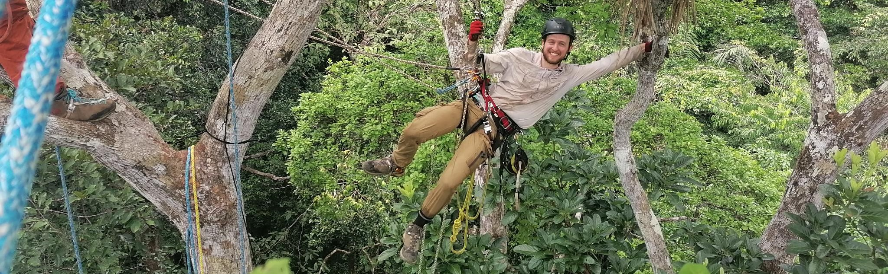
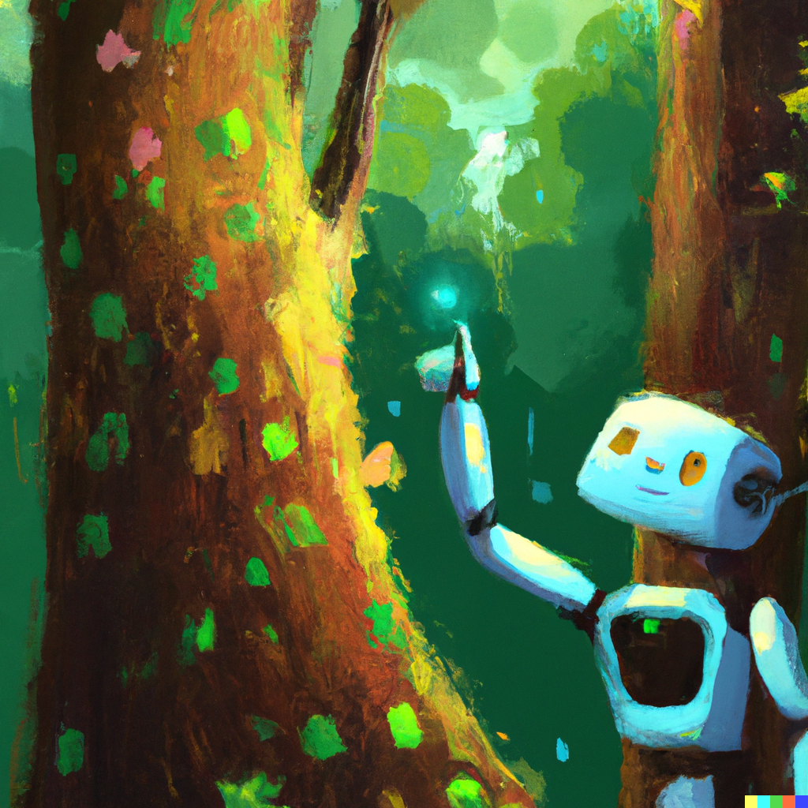

Conservation Research Institute and Department of Plant Sciences, University of Cambridge.

Linking cutting edge AI computer vision techniques to remote sensing for tropical forest observation and monitoring.

## Python packages

[`detectree2`](https://github.com/PatBall1/detectree2) - Python package for automatic tree crown delineation based on Mask R-CNN &emsp; &emsp; &emsp; &emsp; &emsp; &emsp; &emsp; &emsp; &emsp; &emsp; &emsp; &emsp;   

## Selected publications

Ball, J. G. C., Hickman, S. H., Jackson, T. D., Koay, X. J., Hirst, J., Jay, W., ... & Coomes, D. A. (2023). [Accurate delineation of individual tree crowns in tropical forests from aerial RGB imagery using Mask R‐CNN](https://zslpublications.onlinelibrary.wiley.com/doi/10.1002/rse2.332). *Remote Sensing in Ecology and Conservation*.

Brodie, J.F., Mohd-Azlan, J., Chen, C., Wearn, O., Deith, M., **Ball, J. G. C**., ... & M. Luskin. (Accepted). Landscape-scale benefits of protected areas for tropical biodiversity. *Nature*.

Ball, J. G. C., Petrova, K., Coomes, D. A., & Flaxman, S. (2022). [Using deep convolutional neural networks to forecast spatial patterns of Amazonian deforestation](https://besjournals.onlinelibrary.wiley.com/doi/full/10.1111/2041-210X.13953). *Methods in Ecology and Evolution*, 13(11), 2622-2634.

Aubry-Kientz, M., Laybros, A., Weinstein, B., **Ball, J. G. C.**, Jackson, T., Coomes, D., & Vincent, G. (2021). [Multisensor data fusion for improved segmentation of individual tree crowns in dense tropical forests](https://ieeexplore.ieee.org/document/9387530). *IEEE Journal of Selected Topics in Applied Earth Observations and Remote Sensing*, 14, 3927-3936.

Ball, J. G. C., Burgman, M. A., Goldman, E. D., & Lessmann, J. (2021). [Protecting biodiversity and economic returns in resource‐rich tropical forests](https://conbio.onlinelibrary.wiley.com/doi/full/10.1111/cobi.13534). Conservation Biology, 35(1), 263-273.

Vincent, G., Verley, P., Brede, B., Delaitre, G., Maurent, E., **Ball, J. G. C.**, ... & Barbier, N. (2023). [Multi-sensor airborne lidar requires intercalibration for consistent estimation of light attenuation and plant area density](https://www.sciencedirect.com/science/article/pii/S003442572200548X). *Remote Sensing of Environment*, 286, 113442.

## Media

[Unpicking the rhythms of the Amazon rainforest - Where I work: James Ball](https://www.nature.com/articles/d41586-021-00664-1) (2021), *Nature*. 591, 494

## Languages

## Technologies

[![Sentinel](https://img.shields.io/badge/Sentinel-black?style=for-the-badge&logo=data:image/svg+xml;base64,PD94bWwgdmVyc2lvbj0iMS4wIiBlbmNvZGluZz0iVVRGLTgiIHN0YW5kYWxvbmU9Im5vIj8+DQo8IS0tIENyZWF0ZWQgd2l0aCBJbmtzY2FwZSAoaHR0cDovL3d3dy5pbmtzY2FwZS5vcmcvKSAtLT4NCjxzdmcgeG1sbnM6c3ZnPSJodHRwOi8vd3d3LnczLm9yZy8yMDAwL3N2ZyIgeG1sbnM9Imh0dHA6Ly93d3cudzMub3JnLzIwMDAvc3ZnIiB2ZXJzaW9uPSIxLjAiIHdpZHRoPSIyNDIuODg2MDYiIGhlaWdodD0iMjQyLjk3NTEzIiBpZD0ic3ZnMjQyOSI+DQogIDxkZWZzIGlkPSJkZWZzMjQzMSIvPg0KICA8ZyB0cmFuc2Zvcm09InRyYW5zbGF0ZSgtMjg0LjM0NTI5LC0zMTAuODc0NjIpIiBpZD0ibGF5ZXIxIj4NCiAgICA8cGF0aCBkPSJNIDQ0MS4yNzY1Niw0MjEuNjkwOTEgTCA0ODkuMDY4NTEsNDIxLjY5MDkxIEMgNDg5LjA2ODUxLDQyMS42OTA5MSA0OTAuOTU5NDIsNDE0LjUwNjQ3IDQ4Mi40NDgsNDAzLjczNTU2IEMgNDY1LjYzNTc4LDM4Ni4zNjI0NSA0NDYuNzUwOTYsMzk3Ljg4NDI1IDQ0Ni43NTA5NiwzOTcuODg0MjUgQyA0MzcuNDkwOTcsNDAyLjc5NDY2IDQyNS41OTgyNyw0MjMuMTk5NTEgNDMyLjU3NTIsNDUyLjQ4MDU3IEMgNDQxLjI3NjU2LDQ4MS43Njc3NyA0NzQuNzA4MDIsNDg3Ljc5NDQ0IDQ5NS40ODA3LDQ4MC45OTU5IEMgNTA5LjIyOTM1LDQ3Ni40OTgxNSA1MTcuMTU2MjgsNDY2LjU4MjU4IDUyMC45NzA4Miw0NjAuMzYyNjQgQyA1MjIuMTk3NDksNDU1LjMzMDYyIDUyMy4wNzMwMiw0NTAuMjk4NTQgNTIzLjYyNDc5LDQ0NS4yOTYxMyBMIDQ0MS4yNzY1Niw0NDUuMjk2MTMgTCA0NDEuMjc2NTYsNDIxLjY5MDkxIHoiIGlkPSJwYXRoMjQyNSIgc3R5bGU9ImZpbGw6IzAwMzI0NztmaWxsLW9wYWNpdHk6MTtmaWxsLXJ1bGU6bm9uemVybztzdHJva2U6bm9uZSIvPg0KICAgIDxwYXRoIHN0eWxlPSJmaWxsOiMwMDMyNDc7ZmlsbC1vcGFjaXR5OjE7ZmlsbC1ydWxlOm5vbnplcm87c3Ryb2tlOm5vbmUiIGlkPSJwYXRoMjQyMyIgZD0iTSAzOTkuNTAzMTMsMzE0LjA0ODQgQyAzNDkuMDcxNDQsMzE2LjczMDg4IDMwNC4wNzc5MiwzNTEuNjMzNjEgMjkxLjAxMTIzLDQwMy4xNTk5NiBDIDI3NC45MjMyNiw0NjYuNTgyMjggMzEzLjI4NjI0LDUzMS4wOTE1NCAzNzYuNzAyNzMsNTQ3LjE4MjQ4IEMgNDIxLjc2MDE1LDU1OC42MTIzIDQ2Ny40NDk4NCw1NDIuNTYwMDggNDk1LjgzNDgyLDUwOS41NjE4MyBDIDQ4My4zNTM4Nyw1MTIuNTQ1NDYgNDY4Ljc0NzIxLDUxMi43NDQ0IDQ1Mi44OTQwNiw1MDcuMjgxNzkgQyAzOTkuODAzMzYsNDg4Ljk0OTQxIDM5MC4wNzQ0LDQzOS44MTkxNyA0MDMuMzAzMTksNDA1LjQ0IEMgNDE2LjUxNDUzLDM3MS4wNTg1MiA0NjIuNzc0MjMsMzU1LjAzMjg4IDQ5NC44ODQ4LDM3OC4wNzk1MiBDIDUyMi40MDY1OCwzOTcuODE3ODYgNTIzLjkxODQ2LDQzMi45ODUyNSA1MjMuNzY1Myw0NDIuNjgwNjUgQyA1MjguODMwMDksMzg1Ljc4NjQyIDQ5Mi4xNzg4NSwzMzEuOTc2OTkgNDM1LjAzMzc0LDMxNy40Njg0NiBDIDQyMy4xNDMyNCwzMTQuNDUzMDkgNDExLjE0MTI0LDMxMy40MjkzOSAzOTkuNTAzMTMsMzE0LjA0ODQgeiBNIDM0MS43NDIxMSw0MTguNTUwMjMgQyAzNTAuMTYxNjYsNDE4LjU1MDIzIDM1Ni45NDIzOCw0MjUuMzM2MzUgMzU2Ljk0MjM4LDQzMy43NTA1IEMgMzU2Ljk0MjM4LDQ0Mi4xNjk5MiAzNTAuMTYxNjYsNDQ4Ljk1MDc2IDM0MS43NDIxMSw0NDguOTUwNzYgQyAzMzMuMzI4NTksNDQ4Ljk1MDc2IDMyNi4zNTE4NCw0NDIuMTY5OTIgMzI2LjM1MTg0LDQzMy43NTA1IEMgMzI2LjM1MTkxLDQyNS4zMzYzNSAzMzMuMzI4NTksNDE4LjU1MDIzIDM0MS43NDIxMSw0MTguNTUwMjMgeiIvPg0KICA8L2c+DQo8L3N2Zz4=)](https://sentinel.esa.int/)

## Consultancy

I am available for consultancy work related to my research fields and expertise. My skills include utilizing advanced AI and computer vision techniques for tropical forest monitoring and remote sensing applications. My services can be beneficial for environmental consulting firms, governmental and non-governmental organizations, and businesses in sectors such as sustainable forestry, conservation, climate change mitigation, and ecological research. With an established track record in the application of cutting-edge technologies, I offer consultancy in project design, data analysis and interpretation, as well as the development and implementation of AI-based solutions tailored to your needs. If your organization requires support in these areas or has specific project needs, please feel free to [contact me](mailto:ball.jgc@gmail.com).

## Prizes and awards

2022, Research Day Poster Presenter Award (Department of Plant Sciences, University of Cambridge)

2019, NERC PhD studentship

2017, AECOM Prize for outstanding overall academic performance (Imperial College London)

## Education

**PhD in Plant Sciences (AI and Remote Sensing)**\
2019 - 2023 \
Department of Plant Sciences, University of Cambridge

**MSc in Environmental Technology**\
2016 - 2017\
Imperial College London

**MPhys Physics**\
2009 - 2014\
University of Oxford

## Teaching

Undergraduate supervision: Responses to Global Change, Natural Sciences Tripos, Part II, University of Cambridge.

 

    
    <figcaption>Robot in the rainforest. Generated by DALL·E 2.</figcaption>

